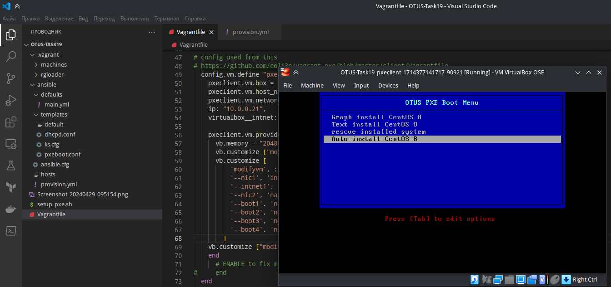
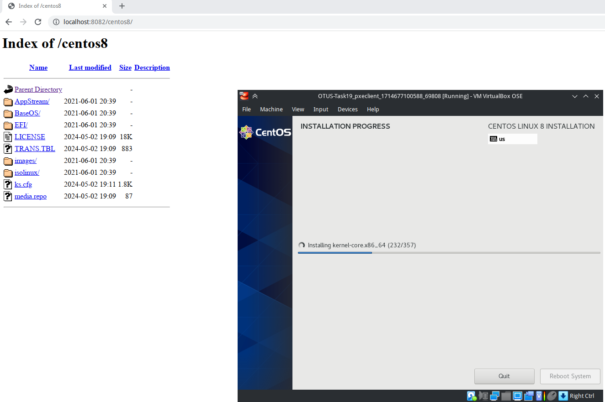

# Задание: Настройка PXE сервера для автоматической установки

Что нужно сделать?

Следуя шагам из документа https://docs.centos.org/en-US/8-docs/advanced-install/assembly_preparing-for-a-network-install установить и настроить загрузку по сети для дистрибутива CentOS8.
В качестве шаблона воспользуйтесь репозиторием https://github.com/nixuser/virtlab/tree/main/centos_pxe.
Поменять установку из репозитория NFS на установку из репозитория HTTP.
Настроить автоматическую установку для созданного kickstart файла (*) Файл загружается по HTTP.

Задание со звездочкой *
автоматизировать процесс установки Cobbler cледуя шагам из документа https://cobbler.github.io/quickstart/.

## Решение:

С помощью `Vagrant` создаются 2 виртуальные машины.

Из-за недоступности образа `bento/centos-8.4` перед командой `vagrant up` выполняем `export VAGRANT_EXPERIMENTAL="disks"`, при создании машины `pxeserver` добавляются дополнительные диски для работой с образом.

После этого выполняется настройка сервера с помощью Ansible.

Комменетарии по работе Ansible даны в самом плейбуке.

Результат: клиент начинает загружваться по сети:

Установка ОС на хост `pxeclient` работает:

